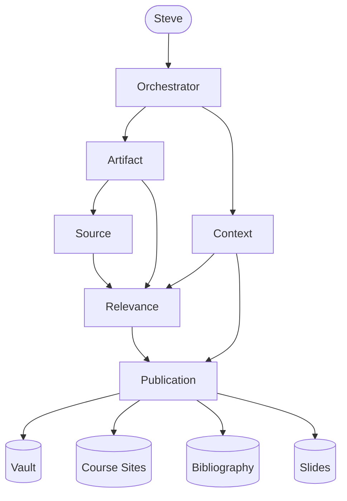
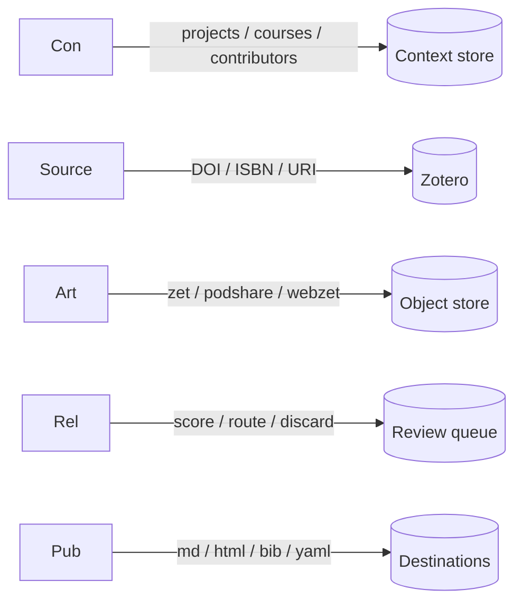

# AIX Agentic Zettelkasten — Six-Agent Architecture

## Premise

The zettelkasten is an agentic knowledge system. Six agents own six domains. Together they transform raw input — conversations, browsing, listening — into routable, citable, reusable knowledge objects.

---

## Agents

### Orchestrator
- **Owns:** direction — roadmap, daily log, session continuity, both tracks
- **Takes orders from:** Steve
- **Gives orders to:** all five agents
- **Inputs:** session start, session end, daily standup trigger
- **Outputs:** standup log, next actions per track, blockers identified
- **Track A:** pipeline development — what gets built, in what order
- **Track B:** course development — what content is needed, for which course, by when

---

### Context
- **Owns:** contexts — projects, courses, contributors, topics, relationships
- **Takes orders from:** Orchestrator
- **Gives orders to:** Relevance, Publication
- **Inputs:** registry file (`steves-registry.md`), project updates
- **Outputs:** valid routing targets, active key list, relationship map
- **Current projects:** herkimer, tdac-ac, pnt, ai-research-workshop, games-nigeria
- **Current courses:** com216, idt555, sts188, fys111
- **Current contributors:** Steve, Asela, Alvin, Bill, Nick, Trusting

---

### Source
- **Owns:** sources — URIs, DOIs, ISBNs, URLs, canonical identifiers
- **Takes orders from:** Orchestrator, Artifact
- **Gives orders to:** Relevance, Publication
- **Inputs:** messy URLs, DOIs, ISBNs, podcast URLs, YouTube URLs
- **Outputs:** canonical URIs, enriched Zotero records, unified bibliography export
- **System of record:** Zotero (three equivalent input surfaces: API, desktop, browser connector)
- **Primary dedup key:** DOI → ISBN → URL-derived canonical URI
- **Domain-specific URI rules:**
  - YouTube: extract video ID → `youtube://[video-id]`
  - Podcast: extract episode URI from RSS feed
  - DOI: validate and normalize via `doi.org`
  - ISBN: validate via `isbnlib`
  - arXiv: extract paper ID
  - GitHub: extract repo/file path
- **Export formats:** JSON (primary), BibTeX (downstream compatibility)
- **Bibliography repo:** `aix-bibliography` (separate from web-facing repos)

---

### Artifact
- **Owns:** generated objects — zets, podshares, webzets
- **Takes orders from:** Steve (via skills), Orchestrator
- **Gives orders to:** Source, Relevance
- **Inputs:** conversation excerpts, voice annotations, URLs, structured form data
- **Outputs:** YAML-frontmattered markdown objects, provenance metadata
- **Skills:** `//zet`, `//webzet`, `//podshare`
- **Provenance fields (required on all outputs):**
  - `capture_mode:` live | post-hoc
  - `model:` claude-sonnet-4-6
  - `session_id:` [session identifier]
- **Key distinction:** Source owns what Steve finds. Artifact owns what Steve makes.

---

### Relevance
- **Owns:** contextualizations — validation scores, routing decisions, curation gate
- **Takes orders from:** Orchestrator, Artifact
- **Gives orders to:** Publication
- **Inputs:** generated artifacts from Artifact agent
- **Outputs:** scored artifacts with routing decision attached
- **Three questions per artifact:**
  1. Is this substantive? (signal vs. noise)
  2. Is this unique? (duplicate check against vault)
  3. Is this routable? (belongs to a named project or course)
- **Three decisions:**
  - **Publish** — route to Publication agent
  - **Hold** — flag for Steve's review
  - **Discard** — low signal, drop
- **Emergent concept detection:** flags dynamic pairs with standalone zettel value (e.g. `founding-optimism` → "Generate `//zet`?")

---

### Publication
- **Owns:** publications — final outputs routed to destinations
- **Takes orders from:** Orchestrator, Relevance, Context
- **Gives orders to:** downstream systems (repos, course sites, vault)
- **Inputs:** validated artifacts from Relevance agent, routing targets from Context agent
- **Outputs:** markdown (vault), HTML (course sites), BibTeX (academic tools), YAML (knowledge graph), slide fragments (presentations)
- **Destinations:**
  - `sunypolyaix/zettel` — atomic notes and conversation summaries
  - `stevesunypoly.github.io/fall26-com216/` — course site content
  - `aix-bibliography` — bibliographic records
  - Obsidian vault — knowledge graph nodes

---

## Pipeline



---

## Data Model



---

## Skill Extensions Required

| Skill | Current state | Required extension |
|---|---|---|
| `//podshare` | Produces chat output only | Write to Zotero via Source agent; route via Pub |
| `//webzet` | Produces markdown + Wayback URL | Write to Zotero; pass through Rel |
| `//zet` | Produces markdown | Add form-based input; slide fragment output |
| `//hello` | Loads registry | Boot Orchestrator; surface daily log |
| `//goodbye` | Zips outputs | Trigger Rel scoring on session artifacts |

---

## Build Roadmap

### Immediate
- Write this spec (done)
- Create `aix-bibliography` repo; migrate `unified.bib`
- Extend skill provenance fields: `capture_mode`, `model`, `session_id`

### Near-term
- Zotero API integration — read/write, DOI/ISBN dedup
- URI normalization module — domain-specific extraction rules
- Relevance agent proof-of-concept — score existing podshares
- Orchestrator daily log — standup format, session continuity

### Deferred
- Full Publication agent — automated multi-format output and repo commits
- `yt-dlp` integration in Cowork — local YouTube/podcast URI extraction
- Batch AIXZ processing — 761-conversation backlog via `strip-corpus.py`
- Context agent live query interface

---

## Daily Log Format

```markdown
## [YYYY-MM-DD]

**Track A (Pipeline)**
- [agent]: [what was built or decided]
- Blockers: [none | description]
- Next: [next action]

**Track B (Courses)**
- [course]: [content generated or needed]
- Blockers: [none | description]
- Next: [next action]
```
